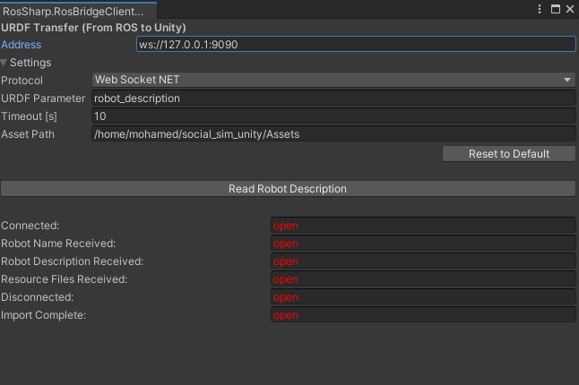
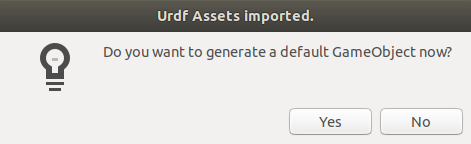
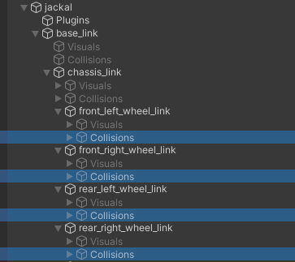
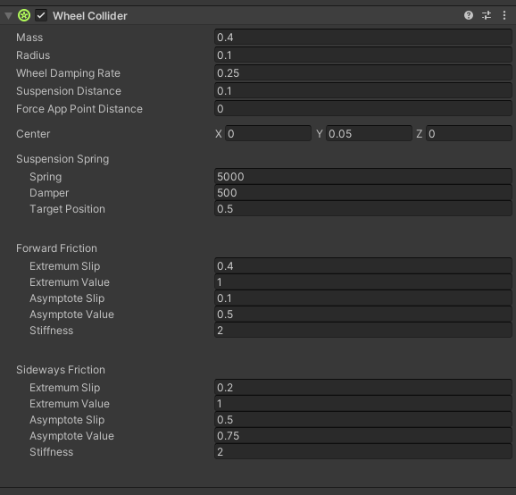
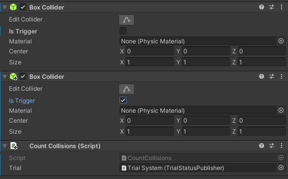
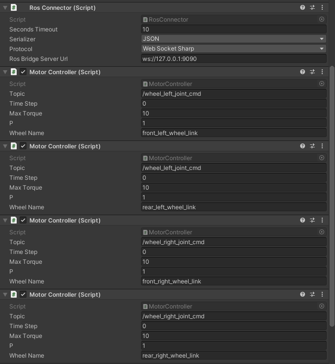
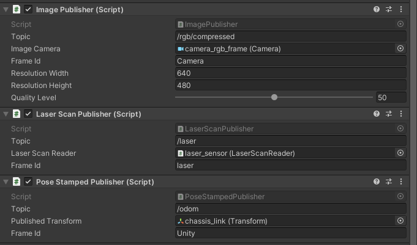

# Editing Unity

## Robots

This guide is to import a URDF robot model to Unity, and update some of its properties to get it ready for working in our environment.

### Importing Jackal

First, we need to transfer the URDF from ROS to Unity, using the ROS-Sharp library importing tool.

There is a similar example for this step in the [ROS-Sharp library docs](https://github.com/siemens/ros-sharp/wiki/User_App_ROS_TransferURDFFromROS).

- Install `rosbridge-suite`:
```
sudo apt-get install ros-melodic-rosbridge-server
```

- Get the `file_server` ROS package from the ROS-Sharp library repo:
```
https://github.com/siemens/ros-sharp/tree/master/ROS/file_server
```

- Get the `jackal_description` ROS package from this git repo:
```
https://github.com/jackal/jackal.git
```

- Run these ROS commands:
```
roslaunch rosbridge_server rosbridge_websocket.launch
rosrun file_server file_server
roslaunch jackal_description description.launch
```

Now, navigate to the Unity window of our project in order to import the published description.

- Go to `RosBridgeClient > Transfer URDF from ROS..`.



- In the dialog box, change the IP address to `ws://127.0.0.1:9090` if you are publishing the URDF description locally from the same machine, or any other address.

- Change the `Asset Path` to any path inside the `Assets` directory of the project.

- Initiate the transfer by clicking the button `Read Robot Description`.

- When this window pops up, click `Yes` to generate the `jackal` game object in the scene.



Now comes the modifying part, we'll remove the colliders that were generated from the URDF for the wheels, and add the Unity wheel collider for each wheel instead.

- Expand the `jackal` game object in the hierarchy pane, and navigate to `jackal > base_link > chassis_link`.

- You should find 4 game objects for the 4 wheels nested under `chassis_link`, and inside each of those wheels there is a `Collisions` game object, just delete those 4 `Collisions` objects (the highlighted objects in this picture).



- On each of the 4 wheels, in the inspector pane, click on `Add Component` and type `Wheel Collider` to add the Unity wheel collider component for each wheel.

- Adjust the physical parameters of the wheel colliders as you see fit, you can go over this [video](https://www.youtube.com/watch?v=mnAEeE3FcvA) to get a better understanding for each of those parameters.

- The values in the following picture work well with `Jackal`:



Another modification to make is to configure the chassis colliders of the robot to work with our collision counter script.

- In the hierarchy pane, navigate to `jackal > base_link > chassis_link > Collisions > unnamed > Box`.

- In the inspector pane, make a duplicate of the `Box Collider` component by copying and pasting it as a new component on the same object, then enable the `Is Trigger` boolean in the new component.

- Add the `Count Collisions (Script)` component to the same object, the components of the object now should look like this:



The last step is to add the ROS bridge scripts to the `jackal` game object, these scripts are responsible for controlling the robot, publishing the camera and laser sensors back to ROS, and publishing the current position of the robot.

- On the `jackal` game object, add the components shown in the following picture, and change the topic name of each script to work with your ROS nodes:




## Map

### Generate a Static Map

A static map for a scene can be generated in Unity.

- Add the `CreateMap` prefab to a scene.

- Resize and reposition the `LowerMap` object to cover the area of the scene you wish to map

- Assign the main scene object to the `Map Creator` script. In our example, this is the `Lab` object. 

- Start a `roscore` and press the play button in the Unity Editor.

- Wait until you see the following message in the Unity Editor Console: 

   ```
   origin (x,y,yaw): ([x value], [y value], 0)
   ```

- The above x and y value are the bottom left coordinates of the map in the ROS map coordinate frame. Create a new folder in the `social_sim_ros/maps` directory with the name of your environment, e.g. 'lab'. Copy the above values into a new `map.yaml` file with the following content:

    ```
    image: short_map.jpg
    resolution: 0.1
    origin: [[x value],[y value],0]
    occupied_thresh: 0.5
    free_thresh: 0.5
    negate: 0
    ```

- The `resolution` parameter should match the resolution specified in the `Map Creator` script in Unity.

- Open an `rqt_image_view` and subscribe to `/short_map_image/compressed` use the save button to save the map image as `short_map.jpg` in the same folder as your `map.yaml` file.

- Finally, launch a map server using your new map with:

    ```
    rosnode map_server map_server $(rospack find social_sim_ros)/maps/lab/map.yaml
    ```

- By convention, launch files for maps for existing environments exist with the name `[environment name]_map_server.launch`


## Sensors

The laser senser is provided by ROS#:

## Pedestrian Navigation Models

# ROS integration

## Custom ROS Messages

ROS messages are stored int he `Messages` folder of the unity project and can be edited directly or imported via [ROS#](https://github.com/siemens/ros-sharp/wiki/Dev_NewMessageTypes)
