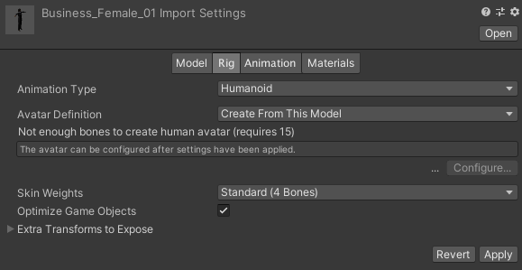

# People

## Microsoft Rocketbox

**GitHub Repository:** [https://github.com/microsoft/Microsoft-Rocketbox](https://github.com/microsoft/Microsoft-Rocketbox)

### Prefabs

#### RocketboxSFRandom

**Path:** Assets/Resources/Prefabs/RocketboxSFRandom.prefab  
**Distribution:** Developed by us

This is the prefab used by *AgentManager* and *TrialAgentManager* scripts to generate characters, it has the 
*RocketboxRandomAvatar* script which picks an avatar prefab at random from the *Resources/Prefabs/Rocketbox* directory and instantiate it in the scene.

### Scripts

#### RocketboxRandomAvatar

**Path:** Assets/Scripts/Agents/RocketboxRandomAvatar.cs  
**Distribution:** Developed by us

This script picks an avatar prefab at random from the *Resources/Prefabs/Rocketbox* directory and instantiate it in the scene in its same location, then it adds to it the necessary components for animation and navigation.

### Making a Rocektbox avatar prefab

- Locate the desired avatar in *Assets/ExternalAssets/Microsoft-Rocketbox/Assets/Avatars*.
- Locate the *\*.fbx* file for this avatar, it will be in the *Export* directory:  

- Click the *\*.fbx* file once, you should see the following in the *Inspector*:  

- In the *Rig* window, adjust the parameters as the picture above, then click *Apply*.
- Now drag the *\*.fbx* file into the scene, and click it to edit its components.
- In the *Animator* component, select *ThirdPersonAnimatorController* as the *Controller*, and for the *Avatar* field, if the character is male, then select *Male_Adult_01Avatar*, if the character is female, then select *Female_Adult_02Avatar*.
- Make sure the other parameters in *Animator* are as the following:  

- Add a *Rigidbody* component to it and keep the default parameters.
- Add a *CapsuleCollider* component to it and modify the parameters according to the height of the avatar, for example the numbers in the following picture work with most heights:  

- Drag the game object from the scene to the *Assets/Resources/Prefabs/Rocketbox* directory to save its prefab to be available for selection by the *RocketboxRandomAvatar* script.

## UMA

**GitHub Repository:** [https://github.com/umasteeringgroup/UMA](https://github.com/umasteeringgroup/UMA)  
**Wiki:** [http://umadocs.secretanorak.com/](http://umadocs.secretanorak.com/)

### Prefabs

#### UMA_DCS

**Path:** Assets/ExternalAssets/UMA/Getting Started/UMA_DCS.prefab  
**Distribution:** Developed by UMA, using it as is

This prefab must be present in any scene in order to add UMA characters to that scene, as it contains all the UMA libraries, context, generator and mesh combiner objects.

#### UMASFRandom

**Path:** Assets/Resources/Prefabs/UMASFRandom.prefab  
**Distribution:** Developed by UMA (*UMARandomGeneratedCharacter*), modified by us

This is the prefab used by *AgentManager* and *TrialAgentManager* scripts to generate characters, it has the *UMARandomAvatar* script which generates an instance of the *UMASFAvatar* prefab with random DNA and clothes.

#### UMASFAvatar

**Path:** Assets/Resources/Prefabs/UMASFAvatar.prefab  
**Distribution:** Developed by UMA (*UMADynamicCharacterAvatar*), modified by us

This is the prefab used by *UMASFRandom* prefab to generate the UMA character, it has the *DynamicCharacterAvatar* script which is responsible for building the UMA character, as well as all the other scripts and components responsible for animation and navigation.

### Scripts

#### DynamicCharacterAvatar

**Path:** <small>Assets/ExternalAssets/UMA/Core/Extensions/DynamicCharacterSystem/Scripts/DynamicCharacterAvatar.cs</small>  
**Distribution:** Developed by UMA, using it as is

This is the main script that is responsible for building the UMA character.

#### UMARandomAvatar

**Path:** <small>Assets/ExternalAssets/UMA/Core/Extensions/DynamicCharacterSystem/Scripts/UMARandomAvatar.cs</small>  
**Distribution:** Developed by UMA, modified by us

This script generates an instance of the *UMASFAvatar* prefab with random DNA and clothes.

## People Control

### Scripts

#### ThirdPersonCharacter

**Path:** <small>Assets/ExternalAssets/StandardAssets/Characters/ThirdPersonCharacter/Scripts/ThirdPersonCharacter.cs</small>  
**Distribution:** Developed by Unity (as a part of the *StandardAssets* library), using it as is

This script is responsible for animating the walking movement of the character.

#### Agent

**Path:** Assets/Scripts/Agents/Agent.cs  
**Distribution:** Developed by [Rutgers Intelligent Visual Interfaces Lab](https://ivi.cs.rutgers.edu/), modified by us

This script is responsible for the character navigation using the Unity AI navigation algorithms, as well as the social forces model.

#### AgentManager

**Path:** Assets/Scripts/Agents/AgentManager.cs  
**Distribution:** Developed by [Rutgers Intelligent Visual Interfaces Lab](https://ivi.cs.rutgers.edu/), modified by us

This script is responsible for spawning agents into random positions, and controlling them throughout the trial by giving each agent a random destination to navigate to once the agent reaches his previous destination.

#### TrialAgentManager

**Path:** Assets/Scripts/Agents/TrialAgentManager.cs  
**Distribution:** Developed by us

This script inherits from the *AgentManager* script and adds the functionality to specify Pathfinding Frequency and Perception Radius for all agents, and also publishes an array of possible spawn positions to ROS.

#### StandaloneAgentManager

**Path:** Assets/Scripts/Agents/StandaloneAgentManager.cs  
**Distribution:** Developed by us

This script inherits from the *AgentManager* script and adds the functionality to specify Pathfinding Frequency and Perception Radius for all agents, and it generates characters locally in Unity without the need to run trials in ROS.

#### KalmanFilterVector3

**Path:** Assets/Scripts/Agents/KalmanFilterVector3.cs  
**Distribution:** Developed by [David Foster](https://gist.github.com/davidfoster/48acce6c13e5f7f247dc5d5909dce349), using it as is

This script filters the output force from the social forces model for each agent, in order to smoothen the animated movement of the agents.

## Adding characters to a scene

First, if we're using UMA avatars, we need to make sure that we drag the UMA_DCS prefab into the scene.

### Manually adding a random character

Just drag an instance of either the *RockeboxSFRandom* prefab (if using Rocketbox), or the *UMASFRandom* prefab (if using UMA) into the scene in the desired position, a random avatar should be spawned in that position.

### Automatically adding random characters

*TrialAgentManager* and *StandaloneAgentManager* scripts can be used to automatically generate random characters in the scene by following these steps:

- Create some placeholder objects with the tag *“Spawn”* to specify the spawn positions.
- Create an empty game object.
- Add *TrialAgentManager* or *StandaloneAgentManager* to that empty object.
- Specify the desired Pathfinding Frequency and Perception Radius in the Inspector pane.
- In Agent Prefab field, select the *RocketboxSFRandom* or *UMASFRandom* prefab.
- In Agent Parent field, select any empty game object to hold the agents’ objects.
- If using *StandaloneAgentManager*, specify the number of agents in Agent Count.
- If using *TrialAgentManager*, specify the spawn positions publisher in Pose Array Publisher.