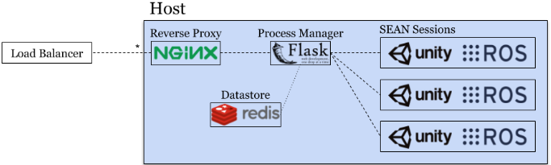

# SEAN-EP

The SEAN Experiment Platform (SEAN-EP) allows deployment of the SEAN simulator at scale on the web. Through SEAN-EP, remote users can control the motion of a human avatar via their web browser and interact with a virtual robot controlled through the Robot Operating System (ROS). Experimental data can easily be recorded for later analysis of social robot navigation algorithms. SEAN-EP includes integration with the Qualtrics survey platform, making it possible to allow study participants to interact with SEAN from within the Qualtrics survey.
 
```eval_rst
.. raw:: html

    <div style="position: relative; padding-bottom: 56.25%; height: 0; overflow: hidden; max-width: 100%; height: auto;">
        <iframe src="https://www.youtube.com/embed/_OeK5Zcx3S4" frameborder="0" allowfullscreen style="position: absolute; top: 0; left: 0; width: 100%; height: 100%;"></iframe>
    </div>
```

## System



Using modern web technologies, the SEAN-EP can be embedded in a web-based survey form to allow quick collection data from online participants.

SEAN-EP consists of SEAN, our Unity and ROS-based simulator. It is described in detail in our [SEAN](index.md) setup instructions. In addition, SEAN-EP allows multiple instances of the simulation environment to be run concurrently via a web-based orchestration tool. Each simulator session is managed by the Process Manager, allowing many concurrent SEAN Sessions. NGINX, the Processes Manager, and a local Datastore are used to serve many SEAN Sessions to users via a standard web browser. Supporting web-scale data collection, SEAN-EP is able to scale horizontally using a session-aware load balancer.

## Deploying SEAN-EP

Please see the [README.md in the social_sim_web code](https://github.com/yale-sean/social_sim_web#social-sim-web) for latest, detailed setup and usage instructions.

### Survey Integration

Our simulation is integrated with the Qualtrics Survey Platform, which makes it easier for researchers to conduct large-scale social robot navigation experiments on the web.

## Human Avatar Control

Please see the [running the simulator](running.md) section on how to control the human avatar.

## Recording Experimental Data

SEAN-EP reports data via ROS topics. These include: avatar, robot, and player positions. Data recording can be done via [rosbag](https://wiki.ros.org/rosbag).
